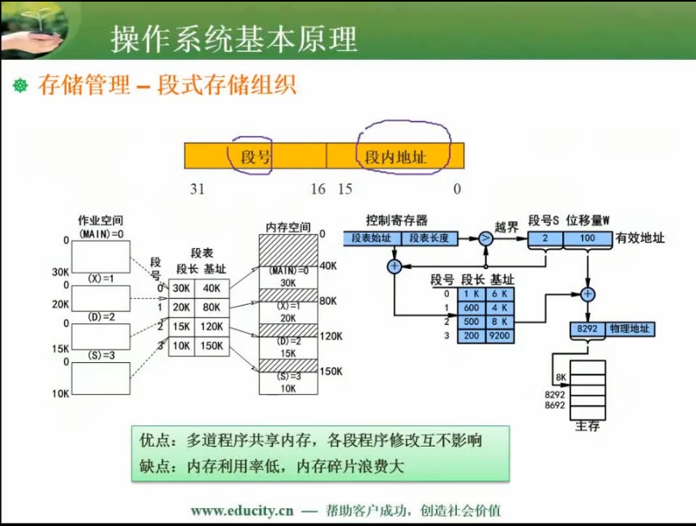
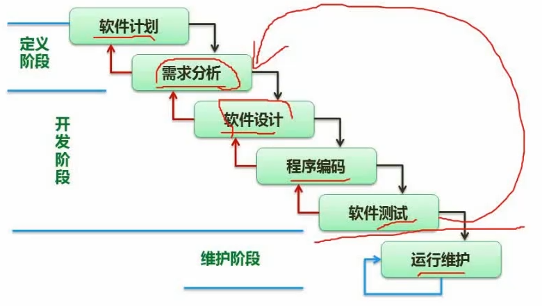
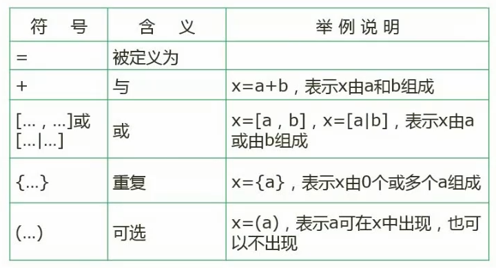

## 数据表示

### 进制转化

n 进制与 10 进制的互转

10进制的浮点数转为2进制的规则（整数部分 2 的幂向高位按位递增 `0, 1, 2, 3...`，小数部分，2的幂向低位按位负数递减 `0, -1, -2, -3 ...`

**测试：十进制 94 转为 二进制**

二进制与八进制、16进制之间的互转


### 原码、反码、补码、移码

1 个字节使用 8 位

使用 `1, -1, 1-1` 来讲解

| 数   | 1         | -1        | 1-1       |
| ---- | --------- | --------- | --------- |
| 原码 | $0000\ 0001$ | $1000\ 0001$ | $1000\ 0010$ |
| 反码 | $0000\ 0001$ | $1111\ 1110$ | $1111\ 1111$ |
| 补码 | $0000\ 0001$ | $1111\ 1111$ | $0000\ 0000$ |
| 移码 | $1000\ 0001$ | $0111\ 1111$ | $0000\ 0000$ |

正数的 `原码、反码、补码` 保持不变

负数的 `反码` 为原码取反（符号位不变），`补码` 为 `反码+1

**移码是符号位取反**

#### 数值的表示范围

|      | 整数                     |
| ---- | ------------------------ |
| 原码 | $-2^{n-1}-1 \sim 2^{n-1}-1$ |
| 反码 | $-2^{n-1}-1 \sim 2^{n-1}-1$ |
| 补码 | $-2^{n-1} \sim 2^{n-1}-1$    |

> 原码和反码比补码的取值范围少一个是因为，他们有 `+0, -0` 占用了 2 个位置
>


### 浮点数计算

浮点数的表示方法： $N = M * R^e$，`M` 尾数，`R` 基数，`e` 指数

计数方法： `对阶 -> 计算 -> 格式化`

加减计算：

1. 指数保持一致，指数小的数向指数大的数转
2. 计算后，对尾数进行调整

乘除法计算，不需要 **对阶** 这一步操作

### 计算机结构 【P6】


### 计算机体系结构分类：Flynn


### CISC 和 RISC（记）


### 流水线

#### 概念


#### 周期


**优先使用理论公式，在没有对应的答案的时候，使用实践公式**

- 理论公式
  - 第一个流水线建立的周期 + 后续流水线全部使用周期中时间最长的一段
- 实践公式
  - 将流水线中的每一个环节都看成一个流水线周期，并且使用时间最长的那个周期作为标准的流水线周期，则计算公式为：`t = (单指令周期 + (指令数量 - 1)) * 单个周期耗时`

####  吞吐率计算


**`K` 是建立流水线花费的时间，`n-1` 指抛开第一条指令花费的时间**

随着流水线的运行，流水线建立的时间花费会被摊薄到每个周期内，极限情况下，可以认为是每个周期完成1条指令

#### 加速比

指未使用流水线技术之前的耗时，与使用之后的耗时，两者之比


#### 效率


### 层次化存储结构


在这个层次结构中，越上层，速度越快；越下层，容量越大

cache这一层可以去掉，但如果引入，可以以较低的成本显著的提高系统的效率

cache 还有一个非常显著的特色 **按内容存储**：不同内容的信息存储到不同的区域，后续再取出来的时候，可以直接算出来。这种模式的存储器也叫 **相连存储器**，他的速度、效率会远高于普通的、按地址的存储方式

#### Cache


#### 主存

##### 分类


##### 编址


#### 磁盘结构和参数


#### 总线

根据总线所处的位置不同，通常分为3类：

- 内部总线
- 系统总线
  - 数据总线
  - 地址总线
  - 操作总线
- 外部总线

#### 系统可靠性分析


串联系统需要每个子模块可行才能总体可行，**计算方式为：每个子系统的可行性的乘积**

并联系统只需要其中一个子模块可行即总体可靠，**计算方式为：`1 - 各子模块的不可行的乘积`**

##### 模冗余系统


每个相同功能的子模块一起工作，得到结果，传递给表决器。根据少数服从多数的依据，来使用值（此前提为错误情况出现较少）

#### 差错控制

##### 循环校验码


核心的理念是，认为系统是相对比较可靠的，即大部分数据传输正确，在此基础上，少数服从多数

###### 模2除法与普通除法（二进制）


普通除法在遇到不够除时，需要退位加数保证数要大于除数，运算时当前数减去除数，余下的部分继续加位用于下次计算

模2除法则为直接顶位，保证当前被除部分的长度与除数长度相等即可，然后做异或操作，结果补位继续下次操作

###### 案例


1. 多项式转化为二进制除数
2. 原始报文补位0，个数为 `二进制除数长度 - 1`
3. 对报文进行模2除法，最后的结果，替换 ② 中的补位数据

##### 海明校验码


## 操作系统基本原理


### 进程管理

#### 进程状态转化


#### 前驱图


表示各个流程的依赖关系以及先后顺序

#### 进程的同步与互斥


#### PV 操作

p 指等待的信号量操作

v 指正在执行的信号量操作

##### 例题：


##### pv 操作与前驱图


#### 死锁问题

##### 银行家算法

计算剩余可用资源，尝试优先保证某个进程完成，然后用释放得到的资源去完成其他的进程


### 内存管理

#### 存储管理

##### 分区存储组织


##### 页式存储组织


##### 段式存储



##### 段页存储

结合页式、段式存储的优点

##### 快表

快表放缓存

慢表放内存

##### 页面淘汰算法习题


```
D:\FDownload\软考\P035-3.14  页面淘汰算法练习题[高清版].flv
```


##### 索引文件结构


**例题**


##### 文件和树形结构


##### 位示图法

例题


#### 设备管理

##### 数据传输方式


##### 虚设备和SPOOLING 计数


引入一个中间层，用于平衡高效内存设备与低效的外部设备之间的矛盾

### 微内核操作系统


## 数据库系统

### 三级模式-二级映射


### 数据库设计过程


### E - R 模型


### 关系代数


#### 笛卡尔积

两个表，`S1 S2` 的所有列完全拼接，拼接后的行数为两表行数乘积

#### 投影

实际是选择出表中需要的列

#### 选择

给定表和条件，过滤得到行记录

### 规范化理论

#### 函数依赖


#### 用途和价值


#### 键


#### 求候选键


**例题**


#### 范式


##### 第一范式


##### 第二范式


##### 第三范式


##### 第四范式（BCNF）


##### 模式分解


## 并发控制

### 概念


**案例**


### 封锁协议


### 数据库的完整性约束


### 数据库安全


### 数据备份

- 冷备份也称为静态备份，是将数据库正常关闭，在停止状态下，将数据库的文件全部备份（复制）下来。
- 热备份也称为动态备份，是利用备份软件，在数据库正常运行的状态下，将数据库中的数据文件备份出来。


- 完全备份：备份所有数据
- 差量备份：仅备份上一次完全备份之后变化的数据
- 增量备份：备份上一次备份之后变化的数据


- 静态海量转储：在系统中无运行事务时进行，每次转储全部数据库。
- 静态增量转储：在系统中无运行事务时进行，每次只转储上一次转储后更新过的数据。
- 动态海量转储：转储期间允许对数据库进行存取或修改，每次转储全部数据库。
- 动态增量转储：转储期间允许对数据库进行存取或修改，每次只转储上一次转储后更新过的数据。

### 故障和恢复


### 反规范化

由于规范化会使表不断的拆分，从而导致数据表过多。这样虽然减少了数据兄余，提高了增、删、改的速度，但会增加查询的工作量。系统需要进行多次连接，才能进行查询操作，使得系统效率大大下降


## 计算机网络

### OSI/RM 七层模型


### 网络技术标准和协议


#### DHCP协议


### 网络分类 - 拓扑结构


### IP 地址


### 分层设计


### 子网划分


### 无分类地址


### 接入方式

#### 有线接入

- 公用交换电话网络（PSTN)
- 数字数据网（DDN)
- 综合业务数字网（ISDN)
- 非对称数字用户线路（ADSL)
- 同轴光纤技术（HFC)

#### 无线接入

- IEEE 802.11 (WiFi)
- IEEE 802.15(蓝牙Bluetooth)
- 红外（IrDA)
- WAPI

#### 3G

- WCDMA
- CDMA 2000
- TD-SCDMA

#### 4G

- LTE-Advanced
- WirelessMAN-Advanced(802.16m)(WiMAX)

### IPv6

IPv6是设计用于替代现行版本IP协议（IPv4）的下一代IP协议。

1. IPv6地址长度为128位，地址空间增大了 $2^{96}$ 倍；
2. 灵活的IP报文头部格式。使用一系列固定格式的扩展头部取代了 IPv4 中可变长度的选项字段。IPv6 中选项部分的出现方式也有所变化，使路由器可以简单路过选项而不做任何处理，加快了报文处理速度；
3. IPv6 简化了报文头部格式，字段只有8个，加快报文转发，提高了吞吐
   量；
4. 提高安全性。身份认证和隐私权是 IPv6 的关键特性；
5. 支持更多的服务类型
6. 允许协议继续演变，增加新的功能，使之适应未来技术的发展；


- 单播地址（Unicast）：用于单个接口的标识符。
- 任播地址（Anycast）：泛播地址。一组接口的标识符，IPv4 广播地址。
- 组播地址（Multicast）：IPv6 中的组播在功能上与 IPV4 中的组播类似。

## 系统安全分析与设计

### 安全属性

- 保密性：最小授权原则、防暴露、信息加密、物理保密
- 完整性：安全协议、校验码、密码校验、数字签名、公证
- 可用性：综合保障（IP过滤、业务流控制、路由选择控制、审计跟踪）
- 不可抵赖性：数字签名

### 对称加密计数


常见算法：

- DES：替换+移位、56位密钥、64位数据块、速度快、密钥易产生
- 3DES(三重DES):两个56位的密钥K1、K2
  加密：`K1加密 -> K2解密 -> K1加密`
  解密：`K1解密 -> K2加密 -> K1解密`
- AES：高级加密标准Rijndael加密法，是美国联邦政府采用的一种区块加密标准
  这个标准用来替代原先的DES。对其要求是“至少与3DES一样安全”。
-  RC-5：RSA数据安全公司的很多产品都使用了RC-5。
- IDEA算法：128位密钥、64位数据块、比DES的加密性好、对计算机功能要求相
  对低，PGP。

缺陷：

- 加密的强度不高
- 密钥分发困难

### 非对称加密


常见算法：

- RSA：512位（或1024位）密钥、计算量极大、难破解
- Elgamal：其基础是Diffie-Hellman密钥交换算法
- ECC：楠圆曲线算法
- 其它非对称算法包括：背包算法、Rabin、D-H

缺陷：

加密速度慢

---

公钥可以随意分发，如果需要使用非对称加密，比如，甲向乙通讯，甲使用乙暴露的公钥加密信息后发送给乙，乙收到消息后使用自己的私钥进行解密

### 信息摘要

```
单向散列函数（hash）、固定长度的散列值
```

常用的消息摘要算法有 `MD5， SHA` 等，市场上广泛使用的 `MD5，SHA` 算法的散列值分别为 128 和 160 位，由于 `SHA` 通常采用的密钥长度较长，因此安全性高于 `MD5`

### 数字签名

基于非对称加密算法

用自己的私钥加密摘要数据，别人使用公钥解析密文，拿到数据，并确认数据的发送方

### 数字信封

- 发送方将原文用对称密钥加密传输，而将对称密钥用接收方公钥加密发送给对方
- 接收方收到电子信封，用自己的私钥解密信封，取出对称密钥解密得原文。

### PGP证书

- PGP可用于电子邮件，也可以用于文件存储。采用了杂合算法，包括IDEA、
  RSA、MD5、ZIP数据压缩算法。
- PGP承认两种不同的证书格式：PGP证书和X.509证书。
- PGP证书包含PGP版本号、证书持有者的公钥、证书持有者的信息、证书拥有者的数字签名、证书的有效期、密钥首选的对称加密算法。
- X 509 证书包含证书版本、证书的序列号、签名算法标识、证书有效期、以下数
  据：证书发行商名字、证书主体名、**主体公钥信息**、发布者的数字签名。

### 网络安全

#### 各个网络层次的安全保障


#### 网络威胁与攻击

| 威胁名称         | 描述                                                         |
| ---------------- | ------------------------------------------------------------ |
| 重放攻击（ARP)   | 所截获的某次合法的通信数据拷贝，出于非法的目的而被重新发送。 |
| 拒绝服务（DOS)   | 对信息或其它资源的合法访问被无条件地阻止。                   |
| 窃听             | 用各种可能的合法或非法的手段窃取系统中的信息资源和敏感信息。例如对通信线路中传输的信号进行搭线监听，或者利用通信设备在工作过程中产生的电磁泄露截取有用信息等。 |
| 业务流分析       | 通过对系统进行长期监听，利用统计分析方法对诸如通信频度、通信的信息流向、通信总量的变化等参数进行研究，从而发现有价值的信息和规律。 |
| 信息泄露         | 信息被泄露或透露给某个非授权的实体。                         |
| 破坏信息的完整性 | 数据被非授权地进行增删、修改或破坏而受到损失。               |
| 非授权访问       | 某一资源被某个非授权的人、或以非授权的方式使用。             |
| 假冒             | 通过欺骗通信系统（或用户）达到非法用户冒充成为合法用户，或者特权小的用户冒充成为特权大的用户的目的。黑客大多是采用假冒进行攻击。 |
| 旁路控制         | 攻击者利用系统的安全缺陷或安全性上的脆弱之处获得非授权的权利或特权。例如，攻击者通过各种攻击手段发现原本应保密，但是却又暴露出的一些系统“特性”。利用这些“特性”，攻击者可以绕过防线守卫者侵入系统的内部。 |
| 授权侵犯         | 被授权以某一目的使用某一系统或资源的某个人，却将此权限用于其它非授权的目的，也称作“内部攻击”。 |
| 特洛伊木马       | 软件中含有一个察觉不出的或者无害的程序段，当它被执行时，会破坏用户的安全 |
| 陷阱门           | 在某个系统或某个部件中设置了“机关”，使得当提供特定的输入数据时允许违反安全策略。 |
| 抵赖             | 这是一种来自用户的攻击，比如：否认自己曾经发布过的某条消息、伪造一份对方来信等。 |

### 防火墙


## 数据算法和结构

### 数组

一维数组

二维数组


### 稀疏矩阵


```
这里的稀疏矩阵，更像是，将一个包含大量空白元素的矩阵转化为一个三角矩阵，但，感觉用途不大
```

### 数据结构的定义


#### 线性表

##### 顺序存储与链式存储对比


##### 队列与栈


##### 广义表


#### 树与二叉树


##### 满二叉树与完全二叉树


##### 反向构造二叉树


##### 树转二叉树

```
孩子结点-左子树结点
兄弟结点-右孩子结点
```


##### 查找二叉树


##### 最优二叉树（哈夫曼树）


##### 线索二叉树


前序线索二叉树：在对数进行前序遍历的结果上，对叶子节点添加虚线样式的线索；绿色的虚线有叶子节点指向在前序遍历结果中的上一个节点，红色虚线指向下一个节点

##### 平衡二叉树


#### 图

##### 基本概念


##### 邻接矩阵


##### 邻接表

首先把每个顶点的邻接顶点用链表示出来，然后用一个一维数组来顺序存储上面每个链表的头指针。


##### 图的遍历


##### 拓扑排序

我们把用有向边表示活动之间开始的先后关系。这种有向图称为用顶点表示活动网络，简称AOV网络。


##### 最小生成树

生成的树中不能包含有闭环

**普里姆算法**

红蓝点思想：任选最短边的两个点，标记为红点，其余点位为蓝点；红点集合尝试扩展就近最短的点，标记出边，对应的点移入到红点集合。重复操作到所有点加入红点集


**克鲁斯卡算法**

最小边原则


### 算法基础

- 有穷性：执行有穷步之后结束。
- 确定性：算法中每一条指令都必须有确切的含义，不能含糊不清。
- 输入（>=0)
- 输出（>=1)
- 有效性：算法的每个步骤都能有效执行并能得到确定的结果。例如 `a=0, b/a` 就无效

#### 算法复杂度

时间复杂度


空间复杂度

### 查找

#### 顺序查找

#### 二分查找

#### 散列表冲突解决

##### 线性探测法

先尝试使用类似 hash 的方式去计算存储的下标，如果被占用，就延后尝试存入，直到检索到空白的槽位

##### 伪随机法


### 排序


#### 插入排序

前 k 个数已经排列好顺序，计算第 `k+1` 在前 k 个数需要插入的位置 n，n到k 之间的数往后移 1 位，原来第 `k+1` 的数插入到 n

#### 希尔排序


#### 直接选择排序

在所有的数据中，选择出最小数，与第 1 位的数交换；然后找次小的数，与第 2 为的数交换

#### 堆排序


1. 堆是完全二叉树
2. 小顶堆里，每个节点都小于他的左右子节点
3. 大顶堆里，每个节点都大于他的左右子节点

##### 从数组构造大小堆


1. 先构造出完全二叉树
2. 从最下的子树开始，按照大/小堆的规则，开始调整树的节点
3. 从小往上开始调整各个子树的节点，调整完成后，需要检查子节点的子树构造是否还满足条件（不满足就需要联动调整


#### 冒泡排序

冒泡排序的基本思想是，通过相邻元素之间的比较和交换，将排序码较小的元素逐从底部移向顶部。由于整个排序的过程就像水底下的气泡一样逐渐向上冒，因此称为冒泡算法。

#### 快速排序


#### 归并排序

归并也称为合并，是将两个或两个以上的有序子表合并成一个新的有序表。若将两个有序表合并成一个有序表，则称为二路合并。合并的过程是：比较A[i]和A[j]的排序码大小，若A[i]的排序码小于等于A[j]的排序码，则将第一个有序表中的元素A[i]复制到R[k]中，并令i和k分别加1;如此循环下去，直到其中一个有序表比较和复制完，然后再将另一个有序表的剩余元素复制到R中。


核心就是两个有序子表合并到一个新的数组上。对于子数组的合并，可以使用双指针的思路

#### 基数排序

基数排序是一种借助多关键字排序思想对单逻辑关键字进行排序的方法。基数排序不是基于关键字比较的排序方法，适合于元素很多而关键字较少的序列。基数的选择和关键字的分解是根据关键字的类型来决定的，例如关键字是十进制数，则按个位、十位来分解。


### 各排序算法复杂度和稳定性比较


## 程序设计语言与语言处理程序基础


### 编译过程


### 文法定义


### 表达式


## 法律法规


### 保护期限


### 知识产权人确定


### 侵权判断


## 标准化基础知识

### 标准的分类

- 国际标准：ISO、IEC等国际标准化组织
- 国家标准：GB——中国、ANSI—美国、BS—英国、JIS-日本
- 区域标准：又称为地区标准，如PASC—太平洋地区标准会议、CEN—欧洲标准委员会、ASAC—亚洲标准咨询委员会、ARSO—非洲地区标准化组织
- 行业标准：GJB-中国军用标准、MIT-S-美国军用标准、IEEE-美国电气电子工程师协会
- 地方标准：国家的地方一级行政机构制订的标准
- 企业标准
- 项目规范


## 多媒体基础

### 音频


### 图像


### 媒体的种类

- 感觉媒体：指人们接触信息的感觉形式。如：视觉、听觉、触觉、嗅觉和味觉等。
- 表示媒体：指信息的表示形式。如：文字、图形、图像、动画、音频和视频等。
- 显示媒体（表现媒体）:表现和获取信息的物理设备。如：输入显示媒体键盘、鼠标和麦克风等；输出显示媒体显示器、打印机和音箱等。
- 存储媒体：存储数据的物理设备，如磁盘、光盘和内存等。
- 传输媒体：传输数据的物理载体，如电缆、光缆和交换设备等。

### 计算问题


### 例题


### 常见多媒体标准


### 有损和无损压缩


## 软件工程

### 开发模型


### 瀑布模型

用在需求明确（或二次开发的项目



使用瀑布模型失败的场景可以总结为需求不定，导致进行了大量无效的工作

### 增量模型


### 螺旋模型


### 其余经典模型


v模型强调测试，测试贯穿整个开发周期

### 构件组装模型


### 统一过程（UP/RUP）


### 敏捷开发方法


### 信息系统开发方法


### 需求开发

#### 需求分类与需求获取


### 结构化设计

#### 基本原则


- 保持模块的大小适中
- 尽可能减少调用的深度
- 多扇入，少扇出
- 单入口，单出口
- 模块的作用域应该在模块之中
- 功能应该是可预测的


#### 系统结构/模块结构


### 软件测试

#### 测试原型与类型

- 尽早、不断的进行测试
- 程序员避免测试自己设计的程序
- 既要选择有效、合理的数据，也要选择无效、不合理的数据
- 修改后应进行回归测试
- 尚未发现的错误数量与该程序已发现错误数成正比


#### 测试用例设计


#### 测试阶段


#### McCabe 复杂度


#### 软件运行与维护

软件维护是生命周期的一个完整部分。可以将软件维护定义为需要提供软件支持的全部活动，这些活动包括在交付前完成的活动，以及交付后完成的活动。交付前完成的活动包括交付后运行的计划和维护计划等；交付后的活动包括软件修改、培训、帮助资料等


#### 软件过程改进 - CMMI


### 项目管理


## 面向对象设计

### 需求开发

### 设计原则

- 单一职责原则：设计目的单一的类
- 开放-封闭原则：对扩展开放，对修改封闭
- 李氏（Liskov)替换原则：子类可以替换父类
- 依赖倒置原则：要依赖于抽象，而不是具体实现；针对接口编程，不要针对实现编程
- 接口隔离原则：使用多个专门的接口比使用单一的总接口要好
- 组合重用原则：要尽量使用组合，而不是继承关系达到重用目的
- 迪米特（Demeter)原则（最少知识法则）:一个对象应当对其他对象有尽可能少的了解

### UML


### 设计模式

#### 概念

架构模式：软件设计中的高层决策，例如C/S结构就属于架构模式，架构模式反映了开发软件系统过程中所作的基本设计决策

设计模式：主要关注软件系统的设计，与具体的实现语言无关

惯用法：是最低层的模式，关注软件系统的设计与实现，实现时通过某种特定的程序设计语言来描述构件与构件之间的关系。每种编程语言都有它自己特定的模式，即语言的惯用法。例如**引用-计数**就是C++语言中的一种惯用法

#### 分类


#### 创建型模式

| 设计模式名称                       | 简要说明                                                     |
| ---------------------------------- | ------------------------------------------------------------ |
| Abstract Factory<br />抽象工厂模式 | 提供一个接口，可以创建一系列相关或相互依赖的对象，而无需指定它们具体的类 |
| Builder<br />构建器模式            | 将一个复杂类的表示与其构造相分离，使得相同的构建过程能够得出不同的表示 |
| Factory Method<br />工厂方法模式   | 定义一个创建对象的接口，但由子类决定需要实例化哪一个类。工厂方法使得子类实例化的过程推迟 |
| Prototype<br />原型模式            | 用原型实例指定创建对象的类型，并且通过拷贝这个原型来创建新的对象 |
| Singleton<br />单例模式            | 保证一个类只有一个实例，并提供一个访问它的全局访问点         |

#### 结构型模式

| 设计模式名称            | 简要说明                                                     |
| ----------------------- | ------------------------------------------------------------ |
| Adapter<br />适配器模式 | 将一个类的接口转换成用户希望得到的另一种接口。它使原本不相容的接口得以协同工作 |
| Bridge<br />桥接模式    | 将类的抽象部分和它的实现部分分离开来，使它们可以独立地变化   |
| Composite<br />组合模式 | 将对象组合成树型结构以表示“整体部分”的层次结构，使得用户对单个对象和组合对象的使用具有一致性 |
| Decorator<br />装饰模式 | 动态地给一个对象添加一些额外的职责。它提供了用子类扩展功能的一个灵活的替代，比派生一个子类更加灵活 |
| Facade<br />外观模式    | 定义一个高层接口，为子系统中的一组接口提供一个一致的外观，从而简化了该子系统的使用 |
| Flyweight<br />享元模式 | 提供支持大量细粒度对象共享的有效方法                         |
| Proxy<br />代理模式     | 为其他对象提供一种代理以控制这个对象的访问                   |

#### 行为型模式


## 数据流图

### 基本概念


#### 分层图


#### 数据字典



#### 答题技巧


#### 试题


#### 试题2


## 数据库设计

### 设计过程


### 试题1


### 试题2


## UML 建模

### 图例类型

#### 用例图

 

#### 类图与对象图


#### 顺序图


#### 活动图


#### **带甬道的活动图**


#### 状态图


#### 通信图


### 试题1


### 试题2


## 数据结构和算法基础

### 分治法

对于一个规模为n的问题，若该问题可以容易地解决（比如说规模n较小）则直接解决；否则将其分解为k个规模较小的子问题，这些子问题互相独立且与原问 题形式相同，递归地解这些子问题，然后将各子问题的解合并得到原问题的解

- 该问题的规模缩小到一定的程度就可以容易地解决
- 该问题可以分解为若干个规模较小的相同问题
- 利用该问题分解出的子问题的解可以合并为该问题的解
- 该问题所分解出的各个子问题是相互独立的

- 分解
- 解决
- 合并

#### 递归

运行过程中，自己调用自己 

#### 二分查找


#### 回溯法（深度搜索优先）

八皇后问题


#### 贪心法


#### 动态规划法


### 试题1


## 面向对象程序设计

### 试题1


### 试题2


# Buttom
